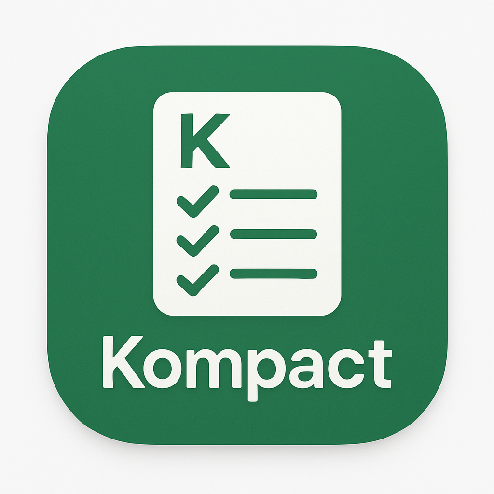

# Kompact

  

Kompact is a minimalist Android app for organizing lists. Built with modern Android development practices and architecture.

## Download

The APK file is included directly in this repository for easy access.

## Features

- Create and manage multiple list types (Generic, Movies, etc.)
- Add, edit, and delete items within lists
- Simple and intuitive UI designed with Material Design 3

## Technical Details

- Built with Kotlin
- MVVM Architecture
- Room Database for local storage
- LiveData and Flow for reactive UI updates
- Material 3 Design components

## Requirements

- Android Studio Hedgehog or newer
- Minimum SDK: 24 (Android 7.0)
- Target SDK: 35
- Kotlin 1.9.22
- Gradle 8.14

## Installation

### Option 1: Direct Download
1. Download the [APK file](app/release/Kompact-v1.0.0.apk) from this repository
2. Enable "Install from Unknown Sources" in your device settings if prompted
3. Open the downloaded APK file to install

### Option 2: Build from Source
1. Clone this repository
2. Open the project in Android Studio
3. Sync project with Gradle files
4. Run on an emulator or physical device

## Screenshots

*Coming soon*

## License

This project is licensed under the MIT License - see the [LICENSE](LICENSE) file for details.

## Contributing

Contributions are welcome! Please feel free to submit a Pull Request.

1. Fork the repository
2. Create your feature branch (`git checkout -b feature/amazing-feature`)
3. Commit your changes (`git commit -m 'Add some amazing feature'`)
4. Push to the branch (`git push origin feature/amazing-feature`)
5. Open a Pull Request

# KompactAndroid
An open-source Android application for creating and managing various types of user-defined lists.
 b25cc62099e714837061c97da5022d81b6167db5
